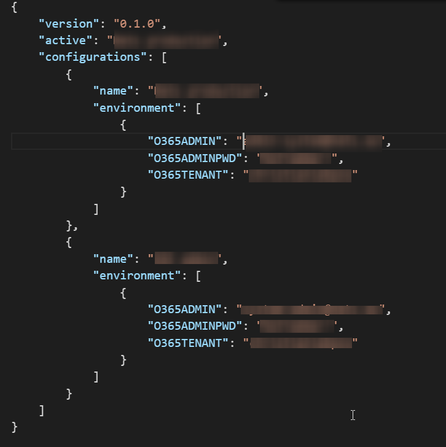

# User Management and adoption tracking

### Summary ###
This solution contains a library of "Click and play" functions that allows you to perform complex provisioning and artifact management actions towards Offic365 and other cloud services. The commands use CSOM and can work against both SharePoint Online as SharePoint On-Premises.


### Applies to ###
-  Office 365 Multi Tenant (MT)


### Prerequisites ###
- Microsoft Azure subscription
- Microsoft Office 365 Tenant

### Disclaimer ###
**THIS CODE IS PROVIDED *AS IS* WITHOUT WARRANTY OF ANY KIND, EITHER EXPRESS OR IMPLIED, INCLUDING ANY IMPLIED WARRANTIES OF FITNESS FOR A PARTICULAR PURPOSE, MERCHANTABILITY, OR NON-INFRINGEMENT.**

# Functions included #
[Navigate here for an overview of all functions and their usage (MASTER)](https://github.com/Hexatown/user-functions/tree/master/_docs)
[Navigate here for an overview of all functions and their usage (BETA)](https://github.com/Hexatown/user-functions/tree/beta/_docs)


## Debug configuration
### .vscode\launch.json

This configuration support debugging the current PowerShell file
```json
{
  "version": "0.2.0",
  "configurations": [
    
  {
    "type": "PowerShell",
    "request": "launch",
    "name": "PowerShell Launch (current file)",
    "script": "${file}",
    "args": [],
    "cwd": "${file}"
  }
  ]
}
``` 

### config.json


### Credits ###
https://github.com/SharePoint/PnP-PowerShell